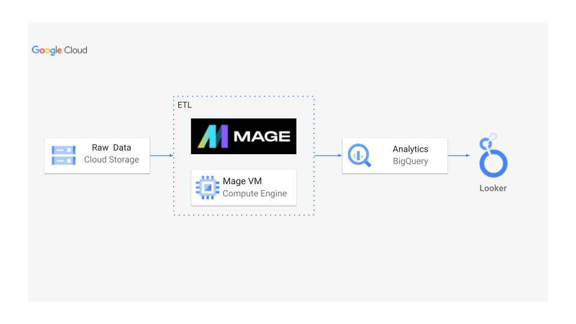
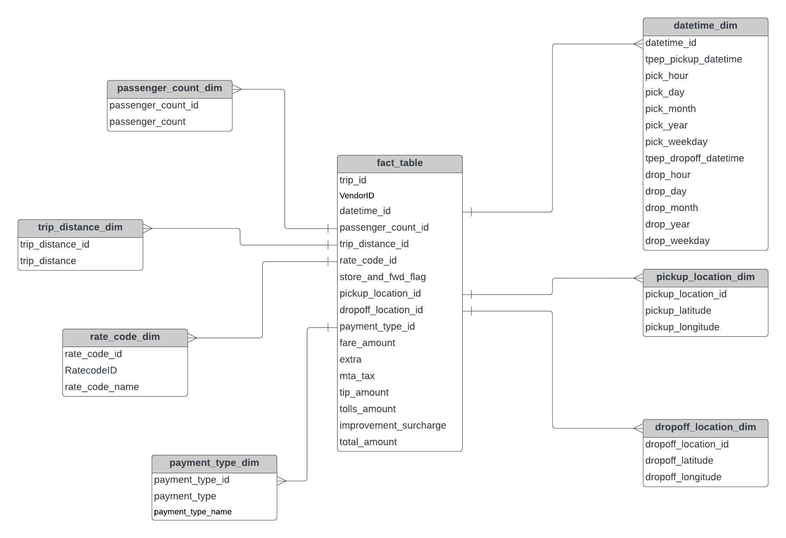

# Uber Data Analytics | Modern Data Engineering GCP Project

## Introduction
This project dives into the world of Uber data analytics using modern data engineering practices on Google Cloud Platform (GCP). We'll leverage tools like Mage.ai for building an ETL pipeline, BigQuery for data warehousing, Looker Studio for data visualization, and Cloud Storage for managing data throughout the process.

## Architecture

## Technology Used
1. Programming Language - Python
2. Scripting Language - SQL
3. Google Cloud Platform
   -  BigQuery
   -  Cloud Storage
   -  Looker Studio
   -  Compute Instance
4. Mage.AI (modern data pipeline tool)

**Modern data Pipeline Tool:** https://www.mage.ai/

**Contribute to this project here:** https://github.com/mage-ai/mage-ai

## Dataset Used
TLC Trip Record Data
Yellow and green taxi trip records include fields capturing pick-up and drop-off dates/times, pick-up and drop-off locations, trip distances, itemized fares, rate types, payment types, and driver-reported passenger counts. 

Here is the dataset used in this project - data/uber_data.csv

### More Info About Dataset
1. Original Data Source - https://www.nyc.gov/site/tlc/about/tlc-trip-record-data.page
2. Data Dictionary - https://www.nyc.gov/assets/tlc/downloads/pdf/data_dictionary_trip_records_yellow.pdf

## Data Model

## Scripts for project
1. [Extract Python File](mage-files/extract.py)
2. [Load Python File](mage-files/load.py)
3. [Transform Python File](mage-files/transform.py)

## Complete Video Tutorial
Video Link - https://www.youtube.com/watch?v=WpQECq5Hx9g

## About the Maintainer

This project is maintained by **Jyothi Kalakoti**, a Data Analyst with strong skills in **Python, SQL, and data visualization using Power BI and Tableau**. She focuses on building data-driven solutions through data analysis, ETL pipelines, and modern analytics tools.

Her interests include **data analytics, data engineering workflows, and big data technologies**. This project demonstrates the use of cloud-based data pipelines and analytics to generate insights from large datasets.

### Connect
Email:  Kalakotijyothi01@gmail.com